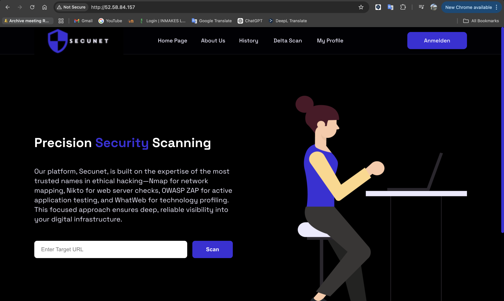
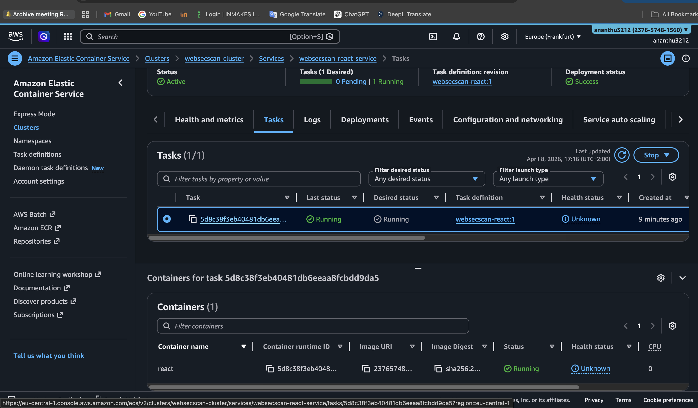
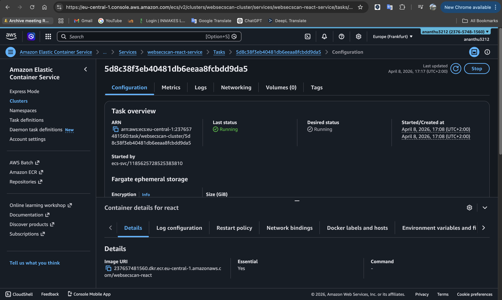
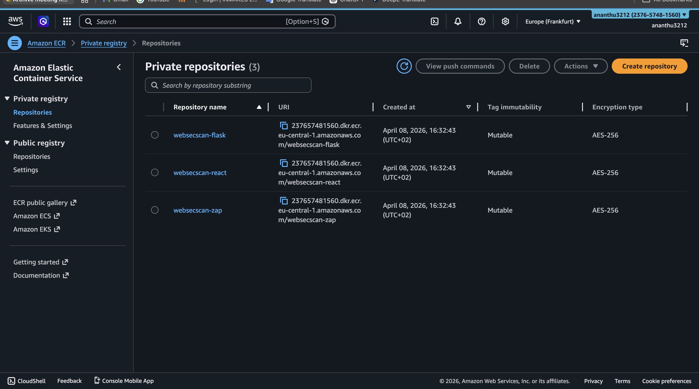
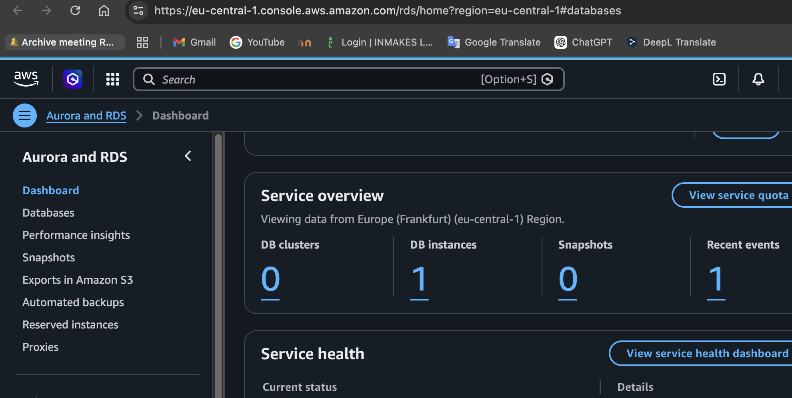
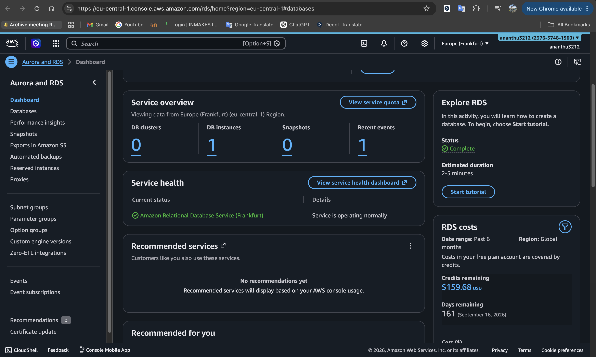

# WebSecScan — Cloud DevOps Infrastruktur

Production-grade cloud deployment of WebSecScan, a web vulnerability 
scanning platform — deployed on AWS using Terraform, Docker, and 
GitHub Actions CI/CD.

## 🔍 Was ist WebSecScan?
WebSecScan ist ein Sicherheitstool zum Scannen von Webseiten auf 
Schwachstellen. Es verwendet OWASP ZAP, Nmap, Nikto, WhatWeb und 
theHarvester. Ergebnisse werden in PostgreSQL gespeichert und über 
ein React-Frontend angezeigt.

> **Hinweis:** Die Anwendung wurde ursprünglich als Teamprojekt 
> entwickelt. Diese Repository konzentriert sich auf die 
> Cloud-Infrastruktur und DevOps-Implementierung.

## 🏗️ Architektur
```
INTERNET
    │
    ▼
Internet Gateway
    │
    ▼
Öffentliches Subnetz (eu-central-1a + eu-central-1b)
├── React Frontend  (ECS Service, Port 80 - Nginx)
└── ZAP Scanner     (ECS Task, bei Bedarf)
    │
    │ nur interner Datenverkehr
    ▼
Privates Subnetz (eu-central-1a + eu-central-1b)
├── Flask Backend   (ECS Service, Port 5001)
└── PostgreSQL      (RDS, Port 5432)
```

## 🛠️ Technologie-Stack

| Kategorie | Technologie |
|---|---|
| Cloud-Anbieter | AWS (eu-central-1 Frankfurt) |
| Infrastructure as Code | Terraform |
| Containerisierung | Docker |
| Container-Registry | AWS ECR |
| Container-Orchestrierung | AWS ECS (Fargate) |
| Datenbank | AWS RDS PostgreSQL 15 |
| CI/CD | GitHub Actions |
| Backend | Flask (Python) |
| Frontend | React + Vite + Nginx |
| Sicherheits-Scanning | OWASP ZAP, Nmap, Nikto, WhatWeb, theHarvester |

## 🔐 Sicherheitsdesign
- Backend-Dienste laufen in **privaten Subnetzen** — nicht aus dem Internet erreichbar
- **Least-Privilege-Sicherheitsgruppen** — jeder Dienst kommuniziert nur mit dem, was er braucht
- Datenbank hat **keine öffentliche IP** — nur Flask kann intern darauf zugreifen
- Geheimnisse werden über **Umgebungsvariablen** verwaltet — nie im Code hart kodiert
- Docker-Images in **privatem ECR** gespeichert — nicht öffentlich zugänglich

## 📁 Projektstruktur
```
websecscan-devops/
├── terraform/
│   ├── main.tf                  # Hauptmodul
│   ├── variables.tf             # Eingabevariablen
│   ├── outputs.tf               # Ausgabewerte
│   └── modules/
│       ├── networking/          # VPC, Subnetze, Gateways
│       ├── security-groups/     # Sicherheitsgruppen
│       ├── rds/                 # PostgreSQL auf AWS RDS
│       ├── ecr/                 # Docker-Image-Registry
│       └── ecs/                 # Container-Orchestrierung
├── Backend/                     # Flask-Anwendung
├── Front-end/                   # React + Vite Anwendung
└── docker-compose.yml           # Lokale Entwicklungsumgebung
```

## 🚀 Deployment

### Voraussetzungen
- AWS-Konto mit konfigurierter CLI
- Terraform installiert
- Docker installiert

### Infrastruktur deployen
```bash
cd terraform
terraform init
terraform plan
terraform apply
```

### Infrastruktur löschen
```bash
terraform destroy
```

## 📚 Was ich gelernt habe
- AWS-Netzwerk (VPC, Subnetze, Sicherheitsgruppen, Routentabellen)
- Infrastructure as Code mit Terraform
- Container-Orchestrierung mit ECS
- DevSecOps-Praktiken — Sicherheit in jeder Schicht
- CI/CD-Automatisierung mit GitHub Actions

## 📸 Live Deployment Proof

### Application Live on AWS


### ECS Service Running Successfully


### ECS Task Running on Fargate


### ECR Private Repositories


### RDS PostgreSQL Database


### RDS Service Overview
